# MORPH AI VIDEOS

### Mobile-first AI video morphing, transformation, and creative video composition platform

[](https://github.com/lucylow/morph-ai-videos)
[](LICENSE)
[](#platform-strategy)
[](#documentation-map)

> **Morph AI Videos** is a mobile-focused creative application concept for turning still imagery and short video assets into smooth AI-assisted morphing experiences, transitions, transformations, and shareable video outputs.
>
> This README documents the product vision, implementation boundaries, architecture, data model, rendering pipeline, reliability strategy, privacy model, developer workflow, testing strategy, deployment approach, and future expansion path.

---

## Repository Verification Note

The public repository currently exposes a minimal root README and a bundled `morph-mobile.zip`. The public repository page reports two commits, while the mobile archive is listed at approximately 1.23 MB. Because the source tree inside the archive is not rendered by the public repository interface, this document intentionally distinguishes **verified repository facts** from **reference architecture and recommended implementation patterns**.

That distinction matters: a strong README should explain the intended system without inventing APIs, providers, files, credentials, or production guarantees that cannot be verified from the visible repository.

The canonical repository is:

`https://github.com/lucylow/morph-ai-videos`

---

# Documentation Map

This README is organized as a long-form engineering document rather than a short project summary.

| Chapter | Topic |
|---|---|
| 01 | Product Overview |
| 02 | Problem Definition |
| 03 | Product Vision |
| 04 | Core User Experience |
| 05 | Feature Architecture |
| 06 | System Architecture |
| 07 | Mobile Application Architecture |
| 08 | AI Orchestration Layer |
| 09 | Media Ingestion |
| 10 | Morph Pipeline |
| 11 | Video Rendering |
| 12 | Job and State Management |
| 13 | Data Model |
| 14 | API Contract Design |
| 15 | Security and Privacy |
| 16 | Storage Architecture |
| 17 | Performance Engineering |
| 18 | Offline and Degraded Modes |
| 19 | Error Handling |
| 20 | Testing Strategy |
| 21 | Observability |
| 22 | Developer Setup |
| 23 | Environment Configuration |
| 24 | Build and Release |
| 25 | Deployment Architecture |
| 26 | Monetization Model |
| 27 | Product Analytics |
| 28 | Accessibility and UX Quality |
| 29 | Roadmap |
| 30 | Contribution Guide and Conclusion |

---

# 01 — Product Overview

## What is Morph AI Videos?

Morph AI Videos is designed as a mobile-first creative tool for transforming source media into visually engaging morphing videos.

The central interaction is simple:

1. Choose a source image, portrait, illustration, or short clip.
2. Choose a destination image or target visual state.
3. Describe the intended transformation or select a transformation preset.
4. Preview the transformation.
5. Adjust motion, duration, transition behavior, crop, and output quality.
6. Render the final clip.
7. Save or share the resulting video.

The product can support a range of experiences: portrait evolution, before-and-after transitions, product transformations, visual storytelling, creative social clips, concept visualization, and experimental image-to-video workflows.

The most important architectural idea is that the mobile client should not be tightly coupled to one AI vendor. AI generation, rendering, and media-processing providers should be abstracted behind a stable application contract so the product can change providers without forcing a redesign of the mobile user experience.

### Product principles

- **Mobile first:** the creation loop must feel natural on a phone.
- **Fast feedback:** previews should appear before expensive final rendering.
- **Provider agnostic:** AI vendors are implementation details, not product concepts.
- **Safe defaults:** quality and cost controls should protect users from accidental expensive renders.
- **Resumable jobs:** long-running video tasks must survive temporary network interruptions.
- **Transparent state:** users should always know whether a task is queued, processing, completed, or failed.
- **Privacy by design:** user media should not be retained longer than necessary.

---

# 02 — Problem Definition

Traditional mobile video editors are optimized for clips that already exist. AI-assisted morphing tools invert that process: the user begins with a visual intent and asks the system to construct an intermediate visual journey between two states.

That creates a different interaction problem.

The user is not only editing a timeline. They are defining a **visual transformation**.

### The core problems

#### 1. Media preparation is fragmented

Users frequently need to crop, resize, orient, normalize, and validate images before an AI pipeline can process them reliably.

#### 2. AI rendering feels opaque

Long-running generation tasks create uncertainty. A mobile product needs clear stages instead of a generic spinner.

#### 3. Different AI providers expose different APIs

Provider-specific request formats, polling models, authentication schemes, limits, and output conventions make direct coupling expensive.

#### 4. Video is computationally expensive

Media generation is heavier than ordinary CRUD application work. Jobs need controlled concurrency, timeouts, retries, and storage lifecycle policies.

#### 5. Mobile constraints are real

A phone may have limited memory, slow connectivity, limited storage, battery constraints, and intermittent foreground execution.

Morph AI Videos therefore benefits from an architecture that separates:

```text
Creative Intent
      ↓
Mobile UX
      ↓
Normalized Generation Request
      ↓
AI / Media Orchestration
      ↓
Rendering + Storage
      ↓
Preview + Final Export
```

---

# 03 — Product Vision

## From “video editor” to “visual transformation studio”

The long-term product should feel less like a complex desktop editor and more like a guided creative studio.

The user describes what should happen. The system manages the complexity of image preparation, AI generation, temporal interpolation, encoding, and delivery.

### Example creative flows

```text
Two portraits
   ↓
Choose “Smooth Evolution”
   ↓
Set duration = 5 seconds
   ↓
Preview transition
   ↓
Render
   ↓
Share
```

```text
Product image A
      +
Product image B
      +
Prompt: “transform the package design gradually”
      ↓
Semantic transformation
      ↓
Motion synthesis
      ↓
Final social video
```

```text
Photo sequence
      ↓
Temporal ordering
      ↓
Keyframe selection
      ↓
Intermediate frame generation
      ↓
Music / captions / overlays
      ↓
Short-form video
```

### Design goal

The interface should hide unnecessary infrastructure details while exposing the controls that affect creative outcomes:

- transformation strength
- motion smoothness
- duration
- aspect ratio
- visual consistency
- output quality
- prompt or transformation description
- optional seed / variation controls where supported

---

# 04 — Core User Experience

## End-to-end user journey

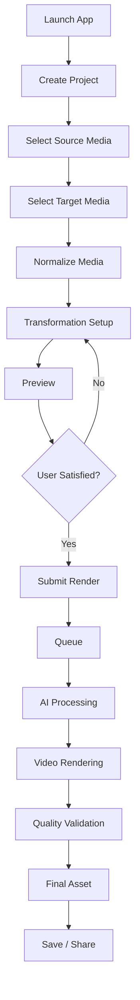

## Home screen

A practical home screen should prioritize creation rather than settings.

Recommended hierarchy:

1. **Create Morph** — primary action.
2. **Recent Projects** — resume unfinished work.
3. **Templates** — guided transformations.
4. **Drafts** — recover interrupted sessions.
5. **Settings** — privacy, account, storage, preferences.

## Project screen

A project should represent one creative output, not merely one API call.

A project may contain:

- source assets
- target assets
- transformation settings
- preview renders
- final renders
- generation attempts
- metadata
- share state
- user notes

This allows users to regenerate without rebuilding the entire creative setup.

---

# 05 — Feature Architecture

## Feature domains

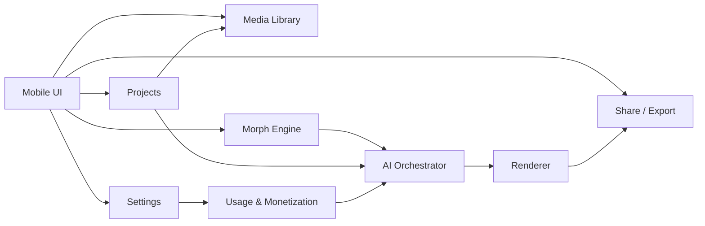

## MVP feature set

### Project creation

- new project
- select input media
- define target state
- save draft
- resume draft

### Transformation controls

- duration
- output ratio
- quality
- transition preset
- prompt / description
- motion intensity

### Preview

- low-cost preview
- frame scrubbing where practical
- restart / loop
- before/after comparison

### Render

- submit job
- progress state
- retry failed job
- background delivery where the platform permits

### Export

- save locally
- system share sheet
- project history

---

# 06 — System Architecture

The reference system architecture separates the mobile client from long-running compute.

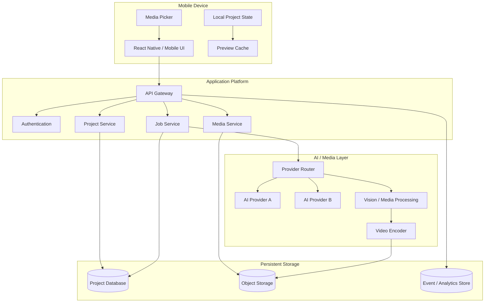

### Why this separation matters

The mobile client should own interaction, local state, validation, and rendering of lightweight previews. It should not own provider secrets or long-lived rendering workloads.

The platform should own orchestration, provider credentials, retries, job state, output normalization, and asset lifecycle.

---

# 07 — Mobile Application Architecture

A maintainable mobile codebase should be organized by domain rather than by an ever-growing component directory.

Recommended structure:

```text
mobile/
├── app/
│   ├── navigation/
│   ├── screens/
│   └── providers/
├── features/
│   ├── projects/
│   ├── media/
│   ├── morph/
│   ├── rendering/
│   ├── sharing/
│   └── settings/
├── components/
├── hooks/
├── services/
│   ├── api/
│   ├── storage/
│   ├── analytics/
│   └── permissions/
├── state/
├── types/
├── utils/
└── assets/
```

## State boundaries

Not every state value should live globally.

### Local UI state

Examples:

- active tab
- modal visibility
- slider position
- preview playback position

### Project state

Examples:

- source asset identifiers
- target asset identifiers
- transformation settings
- selected preset
- current job ID

### Session state

Examples:

- authenticated user
- feature flags
- subscription state
- temporary upload URLs

### Server state

Examples:

- render status
- output URLs
- processing progress
- generation history

Keeping these boundaries explicit reduces accidental coupling and makes failed requests easier to recover.

---

# 08 — AI Orchestration Layer

## Provider abstraction

The most important AI architecture decision is to create an internal normalized contract.

```ts
export interface MorphGenerationRequest {
  projectId: string;
  sourceAssetId: string;
  targetAssetId: string;
  prompt?: string;
  durationSeconds: number;
  outputAspectRatio: string;
  quality: "draft" | "standard" | "high";
  motionStrength?: number;
  seed?: number;
}

export interface MorphGenerationResult {
  jobId: string;
  status: "queued" | "processing" | "completed" | "failed";
  outputAssetId?: string;
  providerMetadata?: Record<string, unknown>;
}
```

A provider adapter then translates this request into the vendor-specific API format.

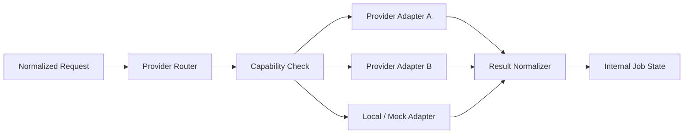

## Routing logic

A production router can consider:

- requested quality
- output duration
- provider availability
- estimated cost
- latency
- supported media type
- regional restrictions
- current queue depth
- feature flags

The application should never depend on a specific provider response shape beyond the adapter boundary.

---

# 09 — Media Ingestion

Media ingestion is the first reliability boundary.

A robust pipeline should validate:

- file type
- dimensions
- orientation metadata
- file size
- frame count for video inputs
- duration for video inputs
- color format where relevant
- corruption / decode failure

## Ingestion pipeline

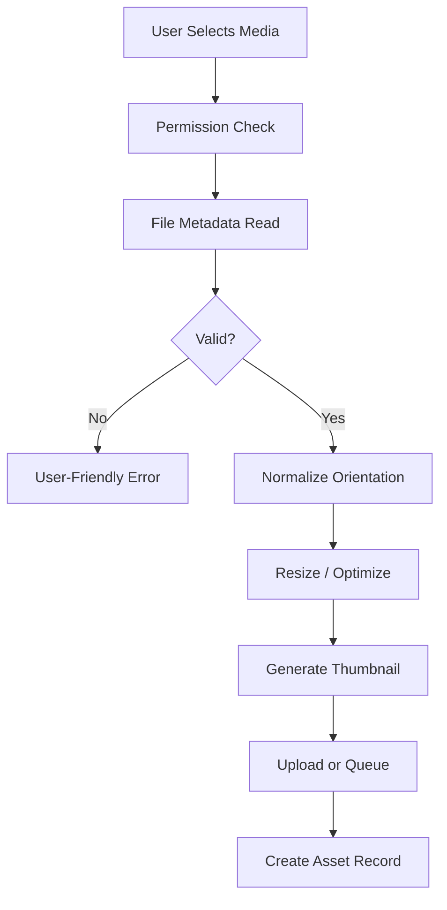

## Why normalization matters

Two images that look identical to a user can still differ in pixel dimensions, EXIF orientation, color encoding, transparency, or compression. AI and media pipelines are more stable when those differences are normalized early.

A practical rule is:

> Normalize once, reuse everywhere.

The normalized asset should become the canonical source for preview, AI generation, and final rendering.

---

# 10 — Morph Pipeline

## Conceptual transformation stages

The morph engine should be treated as a pipeline rather than one opaque function.

```text
SOURCE A
   ↓
Input validation
   ↓
Canonicalization
   ↓
Feature / semantic analysis
   ↓
Correspondence estimation
   ↓
Intermediate-state generation
   ↓
Temporal smoothing
   ↓
Frame synthesis
   ↓
Color / geometry consistency
   ↓
Preview render
   ↓
Final render
```

## Two possible modes

### Deterministic morph

Useful when visual correspondence can be established directly through geometric warping, masks, landmarks, or interpolation.

Advantages:

- predictable runtime
- lower cost
- deterministic results
- useful for fast previews

### Generative morph

Useful when the transformation requires semantic change rather than simple interpolation.

Examples:

- aging or de-aging concepts
- style transformation
- object evolution
- scene transformation
- visual redesign

Advantages:

- higher semantic flexibility
- richer transformation range

Tradeoffs include higher compute, latency, cost, and potential temporal inconsistencies.

A mature product can combine both modes: deterministic preview first, generative final render when the user requests it.

---

# 11 — Video Rendering

## Rendering responsibilities

The rendering layer converts processed frames into a standards-compliant video artifact.

Typical responsibilities include:

- frame ordering
- frame rate selection
- duration enforcement
- audio handling if enabled
- bitrate selection
- codec selection
- container generation
- thumbnail extraction
- output validation

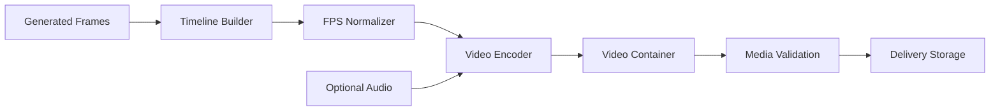

## Preview vs final render

A common product mistake is using the same expensive pipeline for every interaction.

Instead:

```text
Edit setting
    ↓
Fast preview
    ↓
User evaluates result
    ↓
Final render only after approval
```

This reduces compute waste and improves the feeling of responsiveness.

## Output profiles

A platform may eventually expose profiles such as:

| Profile | Typical Use | Priority |
|---|---|---|
| Draft | Editing preview | Speed |
| Standard | General sharing | Balance |
| High | Final creative output | Quality |
| Social Vertical | Short-form mobile content | Format |
| Square | Feed-oriented publishing | Compatibility |
| Landscape | Desktop/video platform | Composition |

Exact codec and bitrate settings should be selected according to the final implementation and deployment environment rather than hard-coded into the product description.

---

# 12 — Job and State Management

Long-running AI video tasks need explicit states.

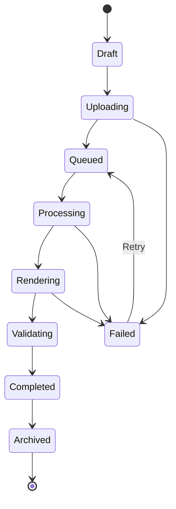

## Job invariants

A job should have:

- unique ID
- project ID
- idempotency key
- created timestamp
- updated timestamp
- current state
- attempt count
- progress estimate when available
- source asset references
- output asset references
- provider metadata
- failure code if failed

## Idempotency

When a mobile request is retried because of a timeout, the backend must distinguish:

> “The user tried again because the response was lost”

from:

> “The user intentionally requested a second render.”

An idempotency key can prevent accidental duplicate jobs.

---

# 13 — Data Model

A practical relational model can remain small and composable.

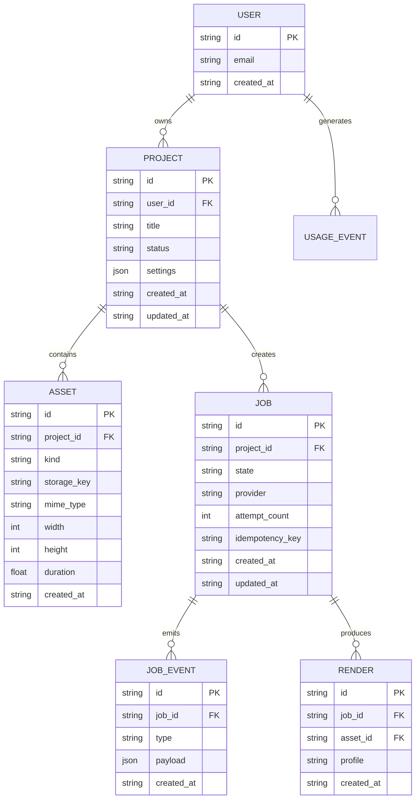

## Design rule

Store references and metadata in the database. Store large binaries in object storage.

Do not place video bytes directly inside relational rows.

---

# 14 — API Contract Design

The API should communicate in product-level terms rather than exposing vendor-specific details.

## Project endpoints

```http
POST /v1/projects
GET  /v1/projects
GET  /v1/projects/:projectId
PATCH /v1/projects/:projectId
DELETE /v1/projects/:projectId
```

## Asset endpoints

```http
POST /v1/assets/upload-url
POST /v1/assets/complete
GET  /v1/assets/:assetId
DELETE /v1/assets/:assetId
```

## Morph endpoints

```http
POST /v1/morph-jobs
GET  /v1/morph-jobs/:jobId
POST /v1/morph-jobs/:jobId/retry
POST /v1/morph-jobs/:jobId/cancel
```

## Example request

```json
{
  "projectId": "project_123",
  "sourceAssetId": "asset_source",
  "targetAssetId": "asset_target",
  "prompt": "Create a smooth cinematic transformation between the two visual states.",
  "durationSeconds": 5,
  "outputAspectRatio": "9:16",
  "quality": "standard",
  "motionStrength": 0.65
}
```

## Example response

```json
{
  "jobId": "job_456",
  "status": "queued",
  "estimatedProgress": 0
}
```

A production API should return structured errors with stable machine-readable codes.

```json
{
  "error": {
    "code": "ASSET_UNSUPPORTED",
    "message": "The selected media format is not supported.",
    "retryable": false
  }
}
```

---

# 15 — Security and Privacy

AI video applications handle highly personal media. Security therefore needs to be a product feature, not only a backend feature.

## Security boundaries

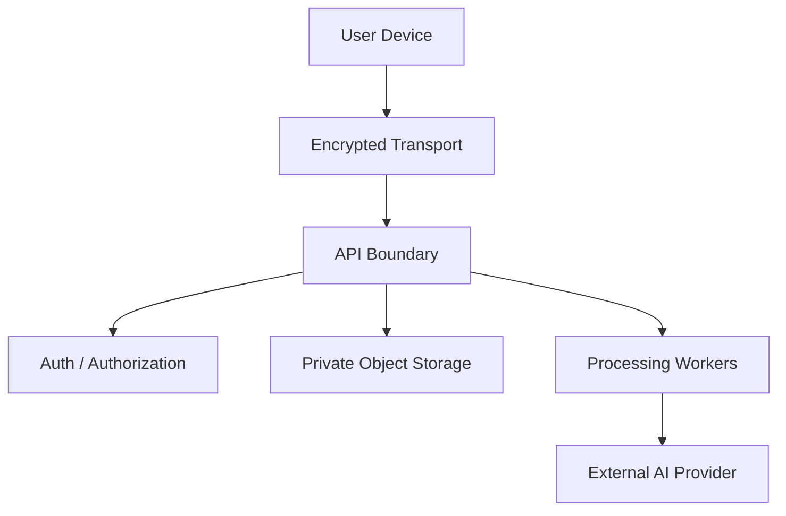

## Core controls

- Never ship provider secrets inside the mobile application.
- Use short-lived upload URLs where practical.
- Validate authorization for every project and asset access.
- Keep private assets private by default.
- Avoid exposing storage keys directly to clients.
- Use signed download URLs for controlled delivery.
- Log access events without storing raw sensitive media in application logs.
- Define a clear retention window for source and generated assets.

## Privacy by design

A useful retention policy can be configured independently for:

- failed uploads
- temporary processing inputs
- preview renders
- completed final renders
- deleted projects

The exact retention period should be a product decision documented in privacy terms and enforced by automated lifecycle jobs.

---

# 16 — Storage Architecture

Video applications have unusual storage characteristics because one user action may create multiple large artifacts.

## Recommended separation

```text
Database
  ├── project metadata
  ├── job state
  ├── asset references
  └── usage records

Object Storage
  ├── original assets
  ├── normalized assets
  ├── preview renders
  ├── final renders
  └── thumbnails
```

## Object lifecycle

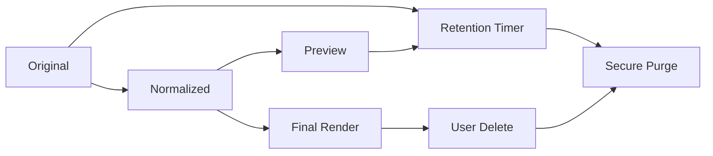

## Storage keys

Avoid predictable paths such as:

```text
/uploads/user123/video.mp4
```

Prefer opaque identifiers:

```text
/projects/{projectId}/assets/{assetId}/{version}/original
/projects/{projectId}/renders/{renderId}/final
```

This prevents accidental collisions and makes versioning explicit.

---

# 17 — Performance Engineering

Performance needs to be measured at the level users experience.

## Important metrics

### Mobile metrics

- app launch time
- time to first interactive frame
- media picker open time
- preview start latency
- memory usage
- local storage growth

### Backend metrics

- upload duration
- queue wait time
- AI provider latency
- render duration
- delivery latency
- job failure rate

### Product metrics

- create-to-preview conversion
- preview-to-render conversion
- render completion rate
- average project edits before render

## Performance model

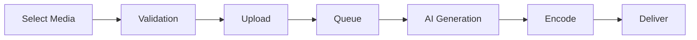

Users perceive the total latency as the sum of these stages.

The easiest stage to optimize is often the stage the user does not actually need. That is why previews, progressive feedback, and deferred final rendering are central to the architecture.

---

# 18 — Offline and Degraded Modes

Mobile connectivity cannot be assumed to be perfect.

The app should remain useful when the network disappears.

## Offline-capable features

- browsing saved projects
- editing project metadata
- adjusting local settings
- reviewing cached previews
- preparing media for upload
- retrying failed jobs later

## Degraded behavior

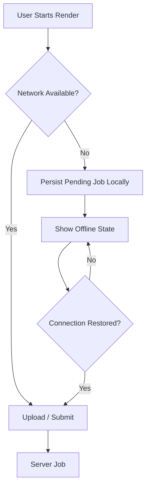

The local pending job should contain enough information to reconstruct a request without duplicating large binary files when those files have already been staged locally.

## Offline-first principle

Never force a user to recreate a project solely because the network disappeared.

---

# 19 — Error Handling

Error handling should be categorized by recovery strategy.

| Error Category | Example | User Action |
|---|---|---|
| Input | Unsupported file | Select another file |
| Permission | Library access denied | Grant access |
| Network | Upload timeout | Retry |
| Quota | Render limit reached | Review usage |
| Provider | Generation unavailable | Retry / fallback |
| Processing | Invalid model output | Regenerate |
| Storage | Output unavailable | Retry delivery |
| Unknown | Unexpected failure | Safe retry + support ID |

## Error contract

Every error should ideally include:

```ts
interface AppError {
  code: string;
  message: string;
  retryable: boolean;
  supportId?: string;
  metadata?: Record<string, unknown>;
}
```

## User experience rule

Do not expose internal stack traces, vendor request IDs, database errors, or raw provider messages to end users.

Instead:

```text
Something went wrong while generating your video.

Your project is safe.

[Retry]
[Save Draft]
```

A support identifier can be shown for advanced troubleshooting.

---

# 20 — Testing Strategy

A media-heavy application requires more than snapshot tests.

## Test pyramid

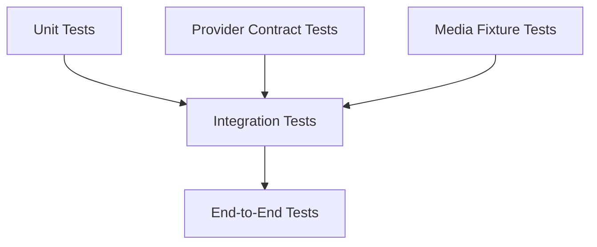

## Unit tests

Test:

- validation rules
- duration calculations
- aspect ratio handling
- state transitions
- retry decisions
- idempotency behavior
- cost / usage calculations

## Integration tests

Test:

- project creation
- upload completion
- job submission
- status polling or event updates
- final asset registration

## Media fixture tests

Maintain a small fixture set representing:

- portrait image
- landscape image
- transparent image
- high-resolution image
- short input video
- malformed file
- unsupported file

Tests should verify that these cases fail safely or normalize correctly.

## End-to-end scenarios

A high-value E2E test is:

```text
Create project
→ select media
→ preview
→ submit render
→ receive completed state
→ play output
→ export/share
```

---

# 21 — Observability

A render pipeline without observability is difficult to operate.

## Tracing model

Each project render should carry a correlation identifier.

```text
project_id
   ↓
job_id
   ↓
provider_request_id
   ↓
render_id
   ↓
asset_id
```

This allows a support request to trace one user action across the entire system.

## Recommended dashboards

### User experience dashboard

- render completion rate
- median preview latency
- median final-render latency
- failure rate

### Infrastructure dashboard

- queue depth
- worker utilization
- provider latency
- object storage failures
- API error rate

### Cost dashboard

- AI generations per day
- average compute cost per completed render
- failed generation cost
- storage growth
- average cost per active user

## Structured logs

Prefer:

```json
{
  "event": "render.completed",
  "jobId": "job_456",
  "projectId": "project_123",
  "durationMs": 182000,
  "profile": "standard"
}
```

instead of unstructured strings that are difficult to query.

---

# 22 — Developer Setup

Because the current public repository exposes the mobile project as an archive rather than a visible source tree, the safest setup process begins by extracting the bundled project and inspecting its package metadata before running commands.

## 1. Clone the repository

```bash
git clone https://github.com/lucylow/morph-ai-videos.git
cd morph-ai-videos
```

## 2. Extract the mobile application

```bash
unzip morph-mobile.zip -d morph-mobile
cd morph-mobile
```

## 3. Inspect the actual package manager

Check for:

```text
package.json
pnpm-lock.yaml
package-lock.json
yarn.lock
bun.lockb
```

Use the lockfile already committed by the mobile project rather than introducing a second package manager.

## 4. Inspect runtime configuration

Look for environment files, configuration modules, and documented setup instructions before starting the app.

Example pattern:

```bash
cp .env.example .env
```

Only do this when `.env.example` actually exists.

## 5. Install dependencies

Use the package manager associated with the project.

Examples:

```bash
pnpm install
```

or:

```bash
npm install
```

or:

```bash
yarn install
```

## 6. Start the development application

Use the command defined by the extracted project's scripts.

For a typical React Native / Expo project, that may resemble:

```bash
npx expo start
```

The exact command should always follow the actual `package.json` scripts in the archive.

---

# 23 — Environment Configuration

Environment configuration should separate public client values from private server secrets.

## Public mobile configuration

Examples can include:

```text
PUBLIC_API_BASE_URL
PUBLIC_APP_ENV
PUBLIC_ANALYTICS_KEY
PUBLIC_FEATURE_FLAGS
```

## Private server configuration

Examples can include:

```text
DATABASE_URL
OBJECT_STORAGE_SECRET
AI_PROVIDER_API_KEY
QUEUE_SECRET
SIGNED_URL_SECRET
```

Private values must never be embedded in a mobile bundle.

## Configuration validation

Configuration should fail fast during development.

```ts
function requireEnv(name: string, value: string | undefined): string {
  if (!value) {
    throw new Error(`Missing required environment variable: ${name}`);
  }
  return value;
}
```

A more advanced version can use schema validation so that invalid URLs, missing values, or unsupported environment names are caught before runtime.

## Configuration matrix

| Variable Class | Mobile | Server | Secret |
|---|---:|---:|---:|
| API base URL | Yes | No | No |
| Public analytics identifier | Yes | No | No |
| Database URL | No | Yes | Yes |
| AI provider key | No | Yes | Yes |
| Object storage signing secret | No | Yes | Yes |

---

# 24 — Build and Release

A reliable release process should produce reproducible artifacts.

## Branch strategy

A simple strategy is sufficient:

```text
main
 ├── feature/*
 ├── fix/*
 └── chore/*
```

For larger teams, release branches and automated semantic versioning can be introduced later.

## Release flow

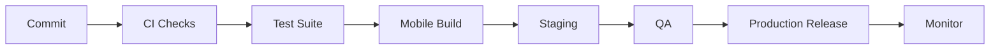

## Release checklist

Before release:

- verify environment configuration
- run linting
- run unit tests
- run integration tests
- verify media permissions
- verify upload and render flows
- verify failure recovery
- verify analytics events
- verify privacy disclosures
- verify app icons / splash / metadata
- create release notes

The most important rule is to test the full **media lifecycle**, not only the screen navigation.

---

# 25 — Deployment Architecture

A production architecture can remain straightforward while scaling horizontally.

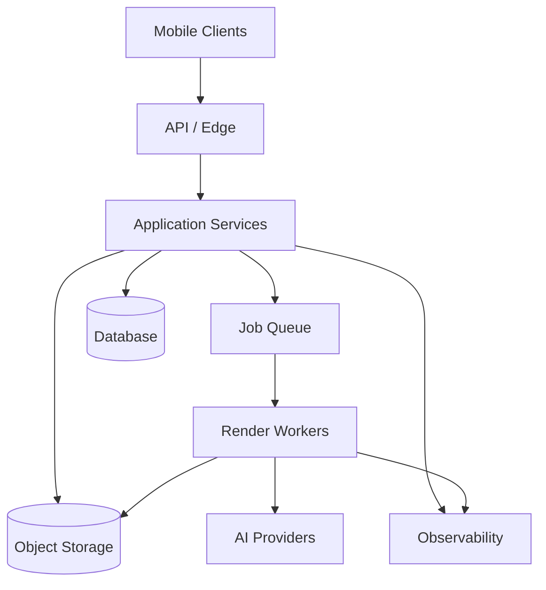

## Horizontal scaling

The worker pool should be independently scalable from the API tier.

For example:

- API instances scale with request volume.
- Queue workers scale with render demand.
- AI provider calls scale according to provider limits.
- Storage scales independently from compute.

This prevents a spike in video generation from unnecessarily increasing the cost of ordinary API traffic.

## Queue protection

Use backpressure when demand exceeds safe processing limits.

Potential controls:

- per-user concurrency limits
- global concurrency limits
- provider-specific rate limits
- priority queues
- maximum pending jobs
- maximum input duration
- maximum output duration

---

# 26 — Monetization Model

The product can support monetization without making the core creative flow confusing.

## Free tier

Potential constraints:

- limited monthly renders
- draft-quality previews
- standard output duration
- optional branding or watermark policy

## Pro tier

Potential benefits:

- more render credits
- higher output quality
- longer clips
- premium presets
- faster queue priority
- advanced export settings
- project history retention

## Credit-based model

Because AI video generation has variable compute cost, credits can align usage with infrastructure economics.

Example conceptual model:

```text
1 preview = low credit cost
1 standard render = medium credit cost
1 high-quality render = higher credit cost
```

The actual prices and entitlements should be defined from measured infrastructure cost rather than arbitrary product assumptions.

## Cost-aware UX

Before submitting an expensive job, the client can communicate:

- estimated duration
- selected quality
- expected credit usage
- whether the task is preview or final

Transparency improves trust and reduces accidental usage.

---

# 27 — Product Analytics

Analytics should answer product questions without unnecessarily collecting sensitive content.

## Core events

```text
app_opened
project_created
media_selected
media_normalized
preview_started
preview_completed
render_submitted
render_started
render_completed
render_failed
export_started
export_completed
share_triggered
subscription_viewed
subscription_started
```

## Funnel model

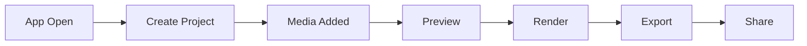

## Privacy-aware analytics

Avoid sending raw user photos, video frames, prompts containing sensitive personal information, or generated video bytes to analytics systems.

A safe event should look like:

```json
{
  "event": "render_completed",
  "quality": "standard",
  "durationBucket": "5-10s",
  "platform": "mobile"
}
```

Analytics should support product learning without becoming a second media-storage system.

---

# 28 — Accessibility and UX Quality

A creative tool still needs strong accessibility.

## Interaction requirements

- touch targets should be comfortably tappable
- color should not be the only status indicator
- progress should be communicated through text as well as animation
- controls should expose accessible labels
- motion-heavy previews should respect reduced-motion preferences where practical
- errors should be announced clearly
- dialogs should be dismissible without gestures alone

## Visual hierarchy

The primary creation flow should have one visually dominant action per screen.

Example:

```text
Project
────────────────────────

[ Source ]     [ Target ]

      Preview
    ┌─────────┐
    │         │
    │  VIDEO  │
    │         │
    └─────────┘

Duration   5s
Motion     ━━━━━●━━
Quality    Standard

[ Generate Video ]
```

A good UI should make the creative state obvious without requiring the user to understand backend concepts.

---

# 29 — Roadmap

## Phase 1 — Stable MVP

- media ingestion
- project creation
- preview pipeline
- normalized morph request
- async render jobs
- final export
- local project history
- basic error recovery

## Phase 2 — AI creative controls

- transformation presets
- prompt-assisted morphing
- style controls
- semantic scene transformations
- smart crop and framing
- auto-generated captions

## Phase 3 — Creator workflow

- template library
- remix projects
- batch rendering
- reusable presets
- project duplication
- collaborative review

## Phase 4 — Advanced generation

- multi-keyframe morphing
- image-to-video continuity
- temporal consistency scoring
- intelligent scene segmentation
- automated audio synchronization

## Phase 5 — Platform expansion

- creator profiles
- private galleries
- publishing workflows
- team workspaces
- creator analytics
- API access for third-party applications

### Long-term product architecture

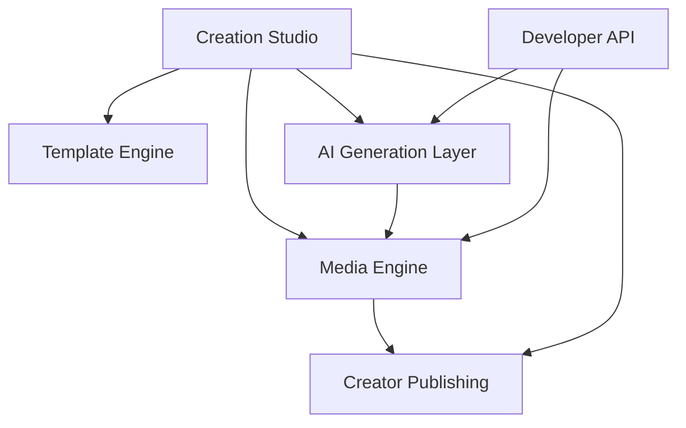

---

# 30 — Contribution Guide and Conclusion

## Contribution principles

Keep changes modular and easy to review.

A good contribution should:

1. Solve one coherent problem.
2. Include tests for important state transitions.
3. Avoid leaking provider-specific logic into UI components.
4. Preserve backward compatibility when practical.
5. Document new environment variables.
6. Document new feature flags.
7. Avoid committing secrets or generated media artifacts.

## Pull request checklist

```text
[ ] Feature or fix described clearly
[ ] Tests added or updated
[ ] Error cases considered
[ ] Mobile permissions tested
[ ] Loading states tested
[ ] Offline / retry behavior considered
[ ] No secrets committed
[ ] Documentation updated
```

## Commit style

A conventional format works well:

```text
feat: add resumable render jobs
fix: recover failed upload state
refactor: isolate provider adapter
perf: reduce preview memory usage
docs: document render lifecycle
```

---

# Technical Design Appendix A — Reference Folder Layout

The following is a recommended target architecture for the extracted mobile project. It is intentionally presented as a reference layout rather than a claim that these exact paths already exist in the archive.

```text
morph-mobile/
├── app/
│   ├── _layout.tsx
│   ├── index.tsx
│   ├── create.tsx
│   ├── project/
│   │   └── [id].tsx
│   └── settings.tsx
│
├── src/
│   ├── components/
│   │   ├── AssetPicker.tsx
│   │   ├── PreviewPlayer.tsx
│   │   ├── ProgressIndicator.tsx
│   │   ├── QualitySelector.tsx
│   │   └── ErrorState.tsx
│   │
│   ├── features/
│   │   ├── projects/
│   │   ├── media/
│   │   ├── morph/
│   │   ├── rendering/
│   │   └── sharing/
│   │
│   ├── services/
│   │   ├── api/
│   │   ├── storage/
│   │   ├── analytics/
│   │   └── permissions/
│   │
│   ├── state/
│   ├── hooks/
│   ├── types/
│   └── utils/
│
├── assets/
├── package.json
└── README.md
```

---

# Technical Design Appendix B — Rendering State Machine

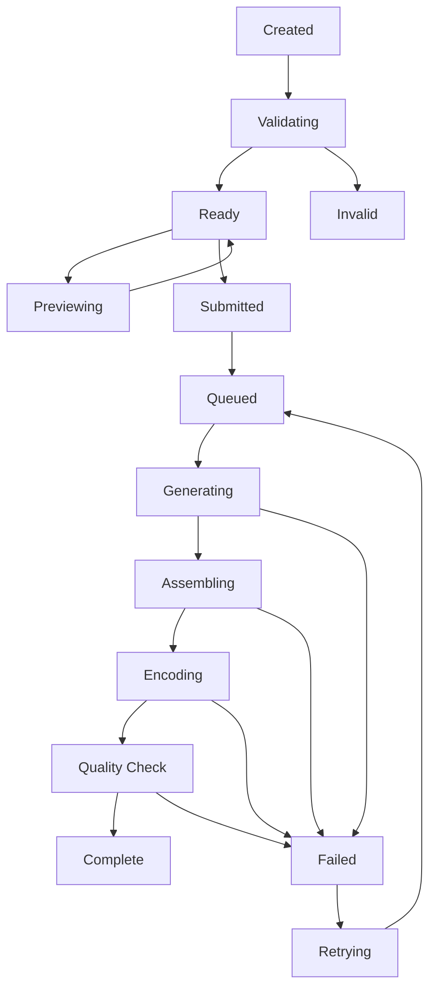

This state machine is useful because it separates the visual progress users see from raw provider statuses.

For example, one provider may report:

```text
queued
running
running
finished
```

while another reports:

```text
pending
processing
completed
```

The application should normalize both into its own internal state model.

---

# Technical Design Appendix C — Provider Adapter Pattern

```ts
interface AIProviderAdapter {
  name: string;

  capabilities(): {
    imageToVideo: boolean;
    multiImageMorph: boolean;
    maxDurationSeconds?: number;
    supportedRatios: string[];
  };

  submit(request: MorphGenerationRequest): Promise<{
    externalJobId: string;
  }>;

  getStatus(externalJobId: string): Promise<{
    status: "queued" | "processing" | "completed" | "failed";
    progress?: number;
    outputUrl?: string;
    errorCode?: string;
  }>;

  cancel(externalJobId: string): Promise<void>;
}
```

The adapter pattern provides four benefits:

### Isolation

The UI never needs to know how a provider authenticates or polls jobs.

### Replaceability

A new provider can be integrated without rewriting project management screens.

### Testing

A mock provider can simulate success, timeout, provider errors, and malformed output.

### Cost control

Routing can choose an adapter based on quality and price without changing product semantics.

---

# Technical Design Appendix D — Mock Provider Strategy

A mock provider is useful for local development and UI testing.

```ts
class MockMorphProvider implements AIProviderAdapter {
  name = "mock";

  capabilities() {
    return {
      imageToVideo: true,
      multiImageMorph: true,
      maxDurationSeconds: 30,
      supportedRatios: ["9:16", "16:9", "1:1"]
    };
  }

  async submit() {
    return {
      externalJobId: `mock_${Date.now()}`
    };
  }

  async getStatus() {
    return {
      status: "completed" as const,
      progress: 1,
      outputUrl: "mock://render/output.mp4"
    };
  }

  async cancel() {}
}
```

The mock provider should never be used to disguise unavailable production functionality. It exists to make the application development loop reliable while external services are unavailable.

---

# Technical Design Appendix E — Cost Controls

AI video products can accidentally create large infrastructure bills if generation is triggered too freely.

Recommended controls:

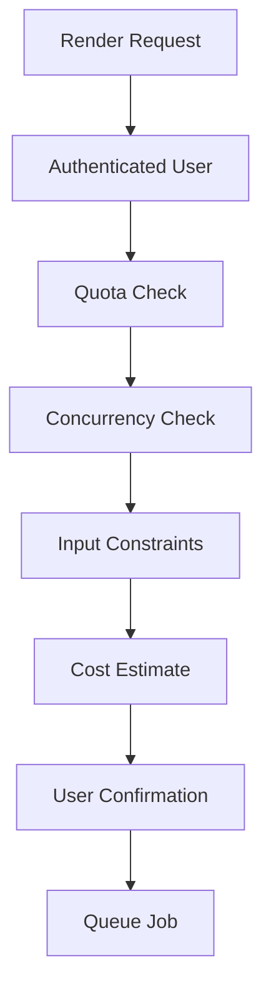

Controls can include:

- maximum duration
- maximum resolution
- maximum concurrent jobs per user
- maximum queued jobs
- credit budget
- provider rate limit
- daily safety cap

These controls should be enforced server-side because client-side checks can be bypassed.

---

# Technical Design Appendix F — Content Safety and Abuse Prevention

A video-generation product should include safeguards that reduce misuse and protect users.

The platform can consider:

- input validation
- rate limiting
- abuse reporting
- account-level throttling
- moderation hooks where appropriate
- audit trails for high-risk operations
- privacy-preserving logging

The moderation layer should be placed before expensive downstream generation whenever possible so obviously invalid requests do not consume unnecessary compute.

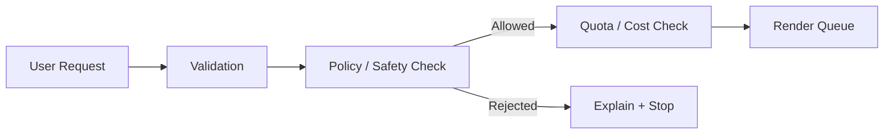

---

# Technical Design Appendix G — Share and Export

Export is not merely “download file”. It is the final product experience.

A useful export flow is:

```text
Render Complete
    ↓
Generate Thumbnail
    ↓
Verify Video Metadata
    ↓
Prepare Shareable Asset
    ↓
Save Locally / Share Sheet
```

The export service should handle cases where:

- local storage is full
- the output URL expired
- the network is temporarily unavailable
- the user has revoked media permissions
- the render has been deleted under retention policy

A strong export experience protects the completed creative result from transient backend failures.

---

# Technical Design Appendix H — Multi-Keyframe Future Architecture

The simplest morph is:

```text
A → B
```

The next evolution is:

```text
A → B → C → D
```

A multi-keyframe engine can represent transformations as a timeline.

```mermaid
flowchart LR
    A[Keyframe A] --> B[Transition 1]
    B --> C[Keyframe B]
    C --> D[Transition 2]
    D --> E[Keyframe C]
    E --> F[Transition 3]
    F --> G[Keyframe D]
```

Each transition can have its own:

- duration
- easing
- semantic prompt
- motion strength
- visual anchor
- camera behavior

This turns Morph AI Videos from a two-state transformer into a lightweight AI animation timeline.

---

# Technical Design Appendix I — Quality Scoring

Generated media can be evaluated before delivery.

Potential checks include:

- output exists
- playable container
- expected duration range
- expected dimensions
- frame count consistency
- audio presence when requested
- corrupted frame detection
- excessive scene discontinuity

A future quality score can combine technical and semantic checks.

```text
Technical Score
      +
Temporal Consistency Score
      +
Prompt Alignment Score
      +
User Feedback Signal
      =
Render Quality Profile
```

A low score does not necessarily mean the user should be blocked. It can instead trigger regeneration, warn the user, or recommend a different setting.

---

# Technical Design Appendix J — Product-Level UX State

The UI should map complex backend states to understandable human language.

| Backend State | User-Facing State |
|---|---|
| `uploading` | Preparing your media… |
| `queued` | Waiting for generation… |
| `processing` | Creating the transformation… |
| `rendering` | Building your video… |
| `validating` | Checking final quality… |
| `completed` | Your video is ready |
| `failed` | We couldn't finish this render |
| `retrying` | Trying again… |

This distinction is critical. Users should understand what the system is doing without needing to learn infrastructure vocabulary.

---

# Technical Design Appendix K — Recommended Feature Flags

Feature flags allow new capabilities to roll out incrementally.

```text
morph.newPreviewEngine
morph.enablePromptControls
morph.enableMultiKeyframe
morph.enableHighQualityRender
morph.enableProviderFallback
morph.enableCredits
morph.enableCreatorTemplates
```

Flags should be evaluated server-side for security-sensitive controls and product entitlements.

---

# Technical Design Appendix L — Future API for Developers

Once the internal API stabilizes, third-party integrations could use a simplified developer surface.

```http
POST /v1/developer/morph
```

```json
{
  "source": "asset://source",
  "target": "asset://target",
  "duration": 5,
  "aspectRatio": "9:16",
  "quality": "standard"
}
```

The platform can then return:

```json
{
  "id": "morph_job_123",
  "status": "queued",
  "statusUrl": "/v1/developer/morph/morph_job_123"
}
```

A developer API should use separate credentials, usage limits, audit trails, and billing from the consumer application.

---

# Technical Design Appendix M — Operational Runbook

When a render fails in production:

### Step 1 — Identify the job

Use the project ID and job ID.

### Step 2 — Check state transition

Confirm the last valid lifecycle state.

### Step 3 — Check provider adapter

Determine whether the provider returned an error or timed out.

### Step 4 — Check storage

Determine whether the output was generated but could not be uploaded or delivered.

### Step 5 — Apply retry policy

Retry only when the failure is classified as retryable.

### Step 6 — Protect the user

Do not create duplicate charges or duplicate renders because an acknowledgment was lost.

### Step 7 — Record root cause

Create a structured incident note so the same failure can be detected automatically later.

---

# Technical Design Appendix N — Documentation Standards

Every future feature should document:

```text
Purpose
User flow
API contract
State transitions
Error states
Persistence
Security considerations
Analytics events
Testing strategy
Rollout strategy
```

This keeps the project understandable as it grows.

---

# Technical Design Appendix O — Final Architecture Summary

The complete reference architecture can be summarized as:

```mermaid
flowchart TB
    USER[Creator]

    subgraph MOBILE[Mobile Experience]
        UX[Creative UI]
        LOCAL[Local Draft State]
        PREVIEW[Preview Player]
        EXPORT[Export / Share]
    end

    subgraph PLATFORM[Application Platform]
        API[API Gateway]
        PROJECTS[Project Service]
        JOBS[Job Service]
        ROUTER[AI Provider Router]
        MEDIA[Media Service]
    end

    subgraph COMPUTE[Media Compute]
        NORMALIZE[Media Normalizer]
        GENERATE[AI Generation]
        RENDER[Video Renderer]
        QA[Quality Validation]
    end

    subgraph DATA[Persistent Infrastructure]
        DB[(Database)]
        STORAGE[(Object Storage)]
        QUEUE[(Queue)]
        OBS[Observability]
    end

    USER --> UX
    UX --> LOCAL
    UX --> API
    LOCAL --> PREVIEW
    API --> PROJECTS
    API --> JOBS
    API --> MEDIA
    PROJECTS --> DB
    MEDIA --> STORAGE
    JOBS --> QUEUE
    QUEUE --> ROUTER
    ROUTER --> GENERATE
    GENERATE --> RENDER
    RENDER --> QA
    QA --> STORAGE
    STORAGE --> EXPORT
    API --> OBS
    JOBS --> OBS
    RENDER --> OBS
```

This architecture creates a clean separation of concerns:

- **Mobile:** creativity, interaction, local resilience.
- **API:** product-level contracts.
- **Job service:** long-running orchestration.
- **AI router:** provider abstraction.
- **Media compute:** normalization, generation, rendering, validation.
- **Database:** metadata and state.
- **Object storage:** binaries.
- **Observability:** diagnosis and optimization.

---

# Closing Notes

Morph AI Videos has a strong foundation for evolving into a specialized mobile creative platform because the central user interaction is easy to understand while the underlying technical system can scale in depth.

The most important implementation principle is to keep the product surface stable while allowing the AI and media infrastructure underneath it to evolve.

That means:

```text
Stable UX
   ↓
Stable Product Contracts
   ↓
Replaceable Providers
   ↓
Observable Jobs
   ↓
Scalable Rendering
   ↓
Reliable Media Delivery
```

The current public repository should be treated as the source of truth for the artifacts that are actually committed. As the mobile archive becomes unpacked into a visible source tree, this README can be tightened further around exact framework versions, folder names, scripts, provider integrations, backend endpoints, and deployment configuration.

---

## Repository

**GitHub:** https://github.com/lucylow/morph-ai-videos

## License

This project is distributed under the MIT License unless the repository's `LICENSE` file states otherwise.

---

<div align="center">

### MORPH AI VIDEOS

**Create the transition. Shape the story. Render the transformation.**

</div>
